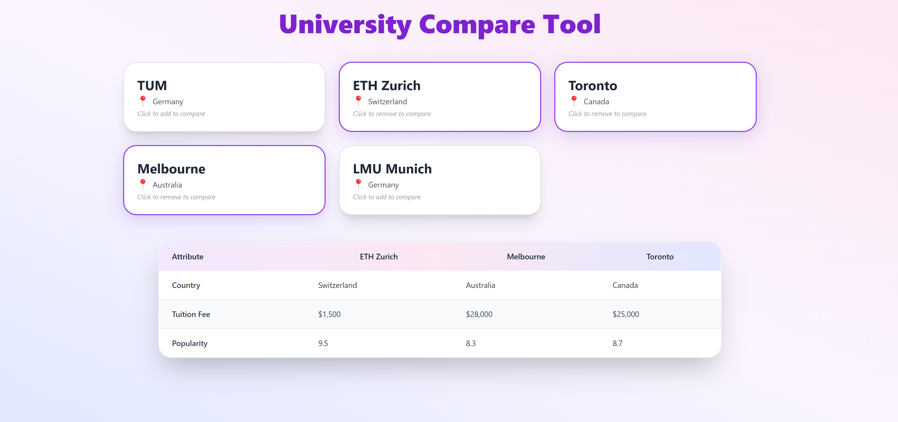

# 🌐 University Compare Tool

A sleek, responsive React app that allows users to visually **compare up to 3 universities side by side** based on tuition fee, country, and popularity.

This project is designed as part of the **Full Stack Developer Internship Task** for [HowToAbroad](https://app.howtoabroad.com), with a focus on **clean UI, intuitive UX**, and **modern frontend development** using **React + Tailwind CSS**.

---

##  Features

-  Select and compare up to **3 universities**
-  Shows side-by-side details: **Country, Tuition Fee, Popularity**
-  Animated cards with **3D hover effects**
-  Gradient background and clean typography (Inter font)
-  Fully responsive and mobile-friendly

---

##  Tech Stack

- **Frontend**: React 18, Tailwind CSS  
- **Design System**: Utility-first styling with custom SVGs and iconography  
- **Fonts**: [Inter](https://fonts.google.com/specimen/Inter)

---

##  How to Run Locally

1. Install Dependencies:

   ```bash
   npm install
1. Install Dependencies:

   ```bash
   npm start

1. Install Dependencies:

   ```bash
   http://localhost:3000
---
##  Preview




---
##  Author

**Ichha Dwivedi**  
BITS Pilani  
[LinkedIn](https://www.linkedin.com/in/ichha-dwivedi-55b246288/) • [GitHub](https://github.com/ID-compiler) • [Email](work.ichhadwivedi.com)

  
